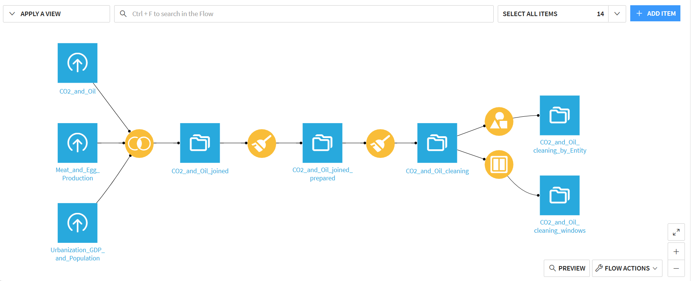
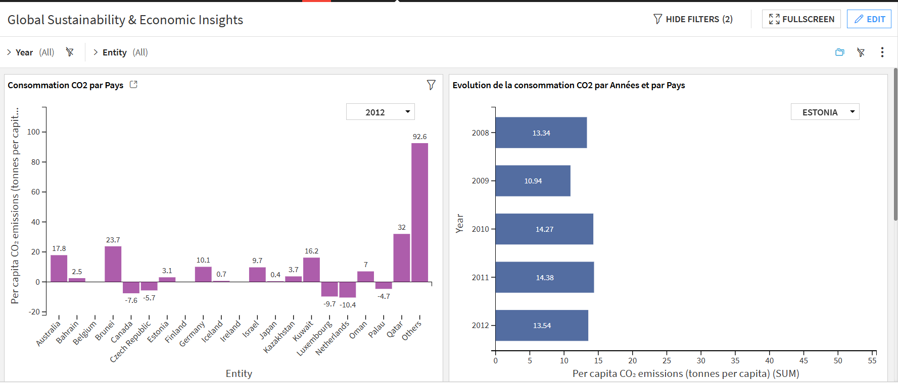
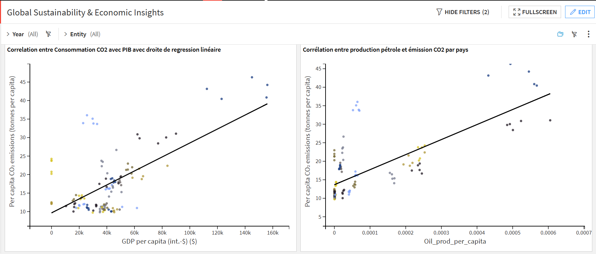
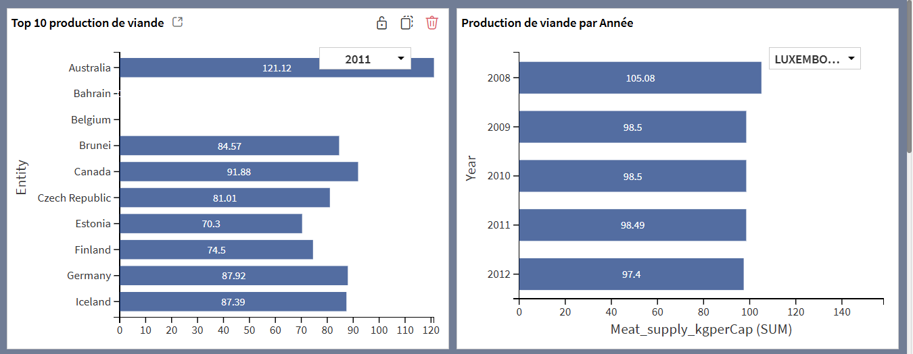
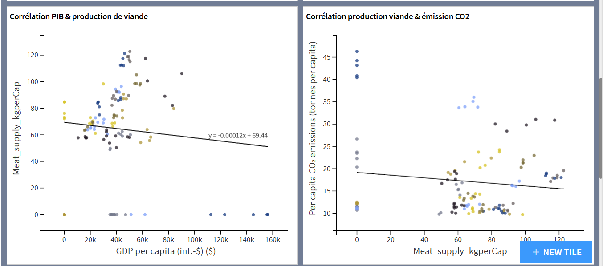
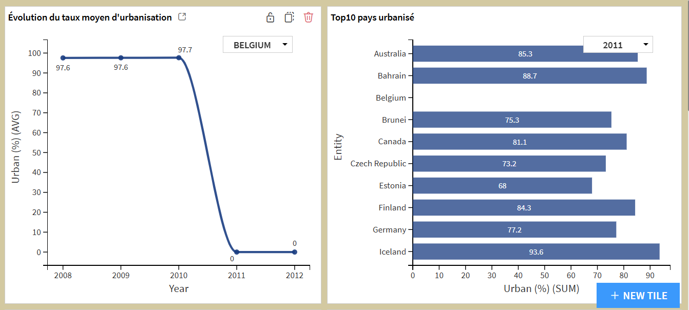
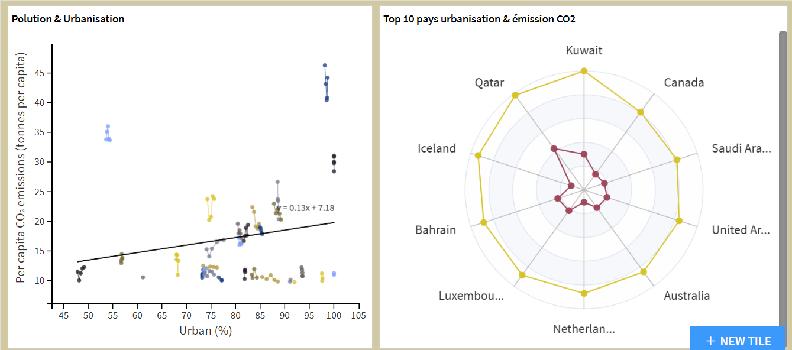
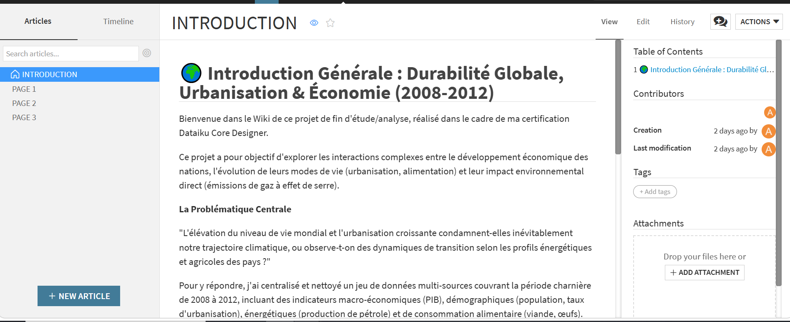

#  Global Sustainability, Urbanization & Economic Insights (2008-2012)

##  Présentation de l'Auteur
* **Nom :** BOUANDJI Josué
* **Email :** josue.bouandji12@gmail.com
* **Rôle :** Data Scientist / Data Analyst
* **Certification :** Dataiku Core Designer

---

##  À propos du Projet
Ce projet de bout en bout a été entièrement conçu et orchestré sur **Dataiku DSS**. Il explore les interconnexions complexes entre la croissance économique des nations, l'urbanisation, la transformation des modes de consommation alimentaire (viande et œufs) et leur impact environnemental direct (émissions de CO2) sur une période charnière allant de **2008 à 2012**.

L'objectif principal est de structurer un pipeline de données industriel robuste et de restituer des analyses visuelles interactives à forte valeur business sous forme de **Storytelling**.

###  La Problématique Centrale
> *"L'élévation du niveau de vie mondial et l'urbanisation croissante condamnent-elles inévitablement notre trajectoire climatique, ou observe-t-on des dynamiques de transition selon les profils énergétiques et agricoles des pays ?"*

---

##  Architecture Technique & Pipeline de Données (Data Engineering)

Le projet intègre trois sources de données distinctes brutes nettoyées et enrichies au travers d'un **Flow Dataiku** optimisé :

1. **Ingestion & Jointure :** Centralisation des jeux de données (`CO2 and Oil`, `Meat and Egg Production`, `Urbanization, GDP and Population`) via des recettes de jointures SQL/DSS natives.
2. **Nettoyage & Préparation (Data Prep) :** Parsing des types, gestion avancée des valeurs manquantes, filtrage des agrégations régionales et création de ratios par habitant au sein de recettes *Prepare*.
3. **Analyses Avancées :** Implémentation de recettes *Window* (fonctions analytiques de fenêtrage) pour générer des classements dynamiques cumulés (`denserank`) et des analyses d'évolution temporelle.

* **Bon à savoir :** Le bundle complet de l'architecture (`.zip`) est présent à la racine de ce dépôt. Il contient l'intégralité du pipeline, des recettes, du dashboard et de la documentation interne. Il est réimportable en 1 clic sur n'importe quelle instance Dataiku DSS.*

  

---

##  Restitution & Storytelling (Le Dashboard)

L'analyse métier est structurée en **3 volets analytiques majeurs** (correspondant aux axes de restitution du Dashboard interactif) :

###  Volet 1 : Développement Économique, Énergie et Émissions
* **Focus :** Corrélation entre le PIB, l'exploitation des énergies fossiles et l'intensité des émissions de CO2.
* **Message Clé :** La richesse économique mondiale reste historiquement indexée sur la pollution atmosphérique. La régression linéaire met en évidence que le PIB par habitant dicte l'empreinte carbone, un phénomène dramatiquement accéléré pour les pays exportateurs ou fortement dépendants du pétrole (ex: Qatar, Koweït).

  

  

###  Volet 2 : Richesse Économique et Empreinte Alimentaire
* **Focus :** Évolution de la production et consommation de viande par habitant en fonction du développement économique.
* **Message Clé :** L'assiette du citoyen global se transforme à mesure que le niveau de vie s'élève. Les pays développés affichent une forte augmentation de la consommation de protéines animales (l'Australie et le Canada se démarquant parmi les plus grands producteurs par habitant), posant la question de l'empreinte environnementale indirecte des régimes alimentaires.

  

  

###  Volet 3 : Urbanisation, Densité et Perspectives Environnementales
* **Focus :** Transition démographique, concentration des populations dans les métropoles et impact carbone (Analyse multifactorielle via Radar Charts).
* **Message Clé :** La concentration urbaine agit comme un accélérateur d'infrastructures énergétiques. Le graphique en radar met en lumière que les pays les plus urbanisés (Belgique, Koweït) sont parmi les plus gros émetteurs de CO2. Cependant, des modèles de cités-États hautement technologiques comme Singapour illustrent qu'une urbanisation à 100% maîtrisée peut viser un plafonnement de son empreinte.

  

  

  ### Wiki : Documentation du projet

  

---

##  Comment déployer ce projet ?
1. Téléchargez le fichier `.zip` présent sur ce dépôt GitHub.
2. Ouvrez votre instance **Dataiku DSS**.
3. Depuis la page d'accueil, cliquez sur **+ NEW PROJECT** > **Import project**.
4. Glissez-déposez le fichier `.zip`. Le Flow, les Datasets, le Dashboard interactif à 6 pages et le Wiki interne seront instantanément recréés et prêts à l'usage.
